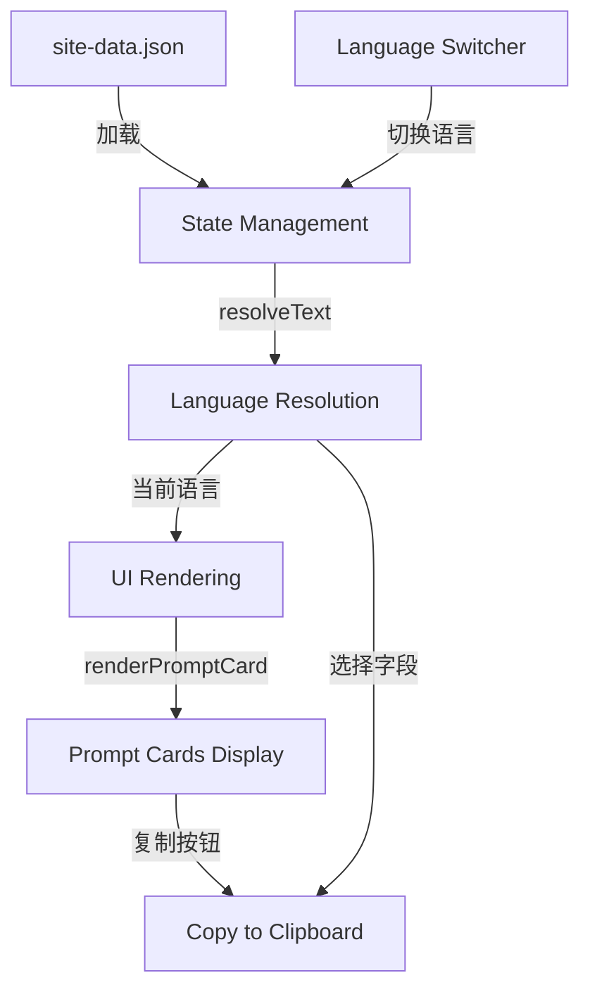

# Design Document: AI Prompt Bilingual Expansion

## Overview

本设计文档描述了 AI 导航页提示词功能的双语扩展实现方案。该功能将现有的 12 个提示词模板扩展到 20+ 个，并为每个提示词添加中英文双语支持。

### 设计目标

1. **数据结构扩展**：将提示词数据结构从单语言扩展为双语支持
2. **内容扩充**：从 12 个提示词扩展到至少 20 个，覆盖更多学术研究场景
3. **语言切换**：实现用户界面的中英文切换功能
4. **向后兼容**：确保现有功能不受影响

### 核心设计原则

- **最小化改动**：复用现有的 `resolveText` 函数和语言切换机制
- **数据驱动**：所有提示词内容存储在 JSON 数据文件中
- **一致性**：新增提示词遵循现有的数据结构和命名约定
- **可维护性**：清晰的数据结构便于后续添加和修改提示词

## Architecture

### 系统架构概览



### 架构层次

1. **数据层 (Data Layer)**
   - `site-data.json` 中的 `promptTemplates` 数组
   - 包含所有提示词的中英文内容

2. **状态管理层 (State Management)**
   - 全局 `state` 对象维护当前语言设置
   - `state.locale` 存储当前语言（"zh" 或 "en"）

3. **语言解析层 (Language Resolution)**
   - `resolveText(item, field)` 函数根据当前语言返回对应字段
   - 支持字段命名约定：`field` (中文) 和 `field_en` (英文)

4. **UI 渲染层 (UI Rendering)**
   - `renderPromptCard(item)` 渲染单个提示词卡片
   - `renderAIPage()` 渲染整个 AI 导航页面

5. **交互层 (Interaction Layer)**
   - 语言切换器触发全局语言状态更新
   - 复制按钮调用 `copyText()` 复制当前语言的提示词内容

## Components and Interfaces

### 数据结构组件

#### Prompt Template 数据结构（扩展后）

```typescript
interface PromptTemplate {
  id: string;              // 唯一标识符，kebab-case 格式
  kind: string;            // 类别（中文）
  kind_en?: string;        // 类别（英文，可选）
  title: string;           // 标题（中文）
  title_en: string;        // 标题（英文）
  summary: string;         // 摘要（中文）
  summary_en: string;      // 摘要（英文）
  prompt: string;          // 提示词内容（中文，保留用于向后兼容）
  prompt_zh: string;       // 提示词内容（中文）
  prompt_en: string;       // 提示词内容（英文）
}
```

#### 字段命名约定

现有系统使用以下命名约定：
- 中文字段：`field`（如 `title`, `summary`, `prompt`）
- 英文字段：`field_en`（如 `title_en`, `summary_en`）

为保持一致性，新增字段遵循相同约定：
- `prompt_zh`：中文提示词（新增，明确标识）
- `prompt_en`：英文提示词（新增）
- `prompt`：保留用于向后兼容，值与 `prompt_zh` 相同

### 核心函数接口

#### resolveText (现有函数，无需修改)

```javascript
/**
 * 根据当前语言设置解析对象的文本字段
 * @param {Object} item - 包含多语言字段的对象
 * @param {string} field - 要解析的字段名
 * @returns {string} 当前语言对应的文本内容
 */
function resolveText(item, field)
```

该函数已支持 `field` 和 `field_en` 的解析逻辑，可直接用于新的双语字段。

#### renderPromptCard (现有函数，无需修改)

```javascript
/**
 * 渲染单个提示词卡片
 * @param {PromptTemplate} item - 提示词模板对象
 * @returns {string} HTML 字符串
 */
function renderPromptCard(item)
```

该函数通过 `resolveText` 获取文本，自动支持双语切换。

#### copyText (现有函数，无需修改)

```javascript
/**
 * 复制文本到剪贴板
 * @param {string} text - 要复制的文本
 * @returns {Promise<void>}
 */
async function copyText(text)
```

### 新增提示词类别

基于需求，新增以下类别的提示词：

1. **反例构造** (Counterexample Construction)
2. **定义形式化** (Definition Formalization)
3. **推广分析** (Generalization Analysis)
4. **计算验证** (Computation Verification)
5. **参考文献格式化** (Reference Formatting)
6. **研究问题提炼** (Research Question Refinement)
7. **报告大纲生成** (Report Outline Generation)
8. **图表说明撰写** (Figure Caption Writing)
9. **误差分析** (Error Analysis)

## Data Models

### 提示词数据模型

#### 现有数据结构（12个提示词）

```json
{
  "id": "proof-outline",
  "kind": "数学证明",
  "title": "证明结构拆解",
  "summary": "把命题拆成假设、目标、关键引理和证明主线。",
  "prompt": "你是一名数学研究助理。请把下面命题整理成证明草稿..."
}
```

#### 扩展后的数据结构

```json
{
  "id": "proof-outline",
  "kind": "数学证明",
  "kind_en": "Mathematical Proof",
  "title": "证明结构拆解",
  "title_en": "Proof Structure Breakdown",
  "summary": "把命题拆成假设、目标、关键引理和证明主线。",
  "summary_en": "Break down propositions into assumptions, goals, key lemmas, and proof outline.",
  "prompt": "你是一名数学研究助理。请把下面命题整理成证明草稿...",
  "prompt_zh": "你是一名数学研究助理。请把下面命题整理成证明草稿...",
  "prompt_en": "You are a mathematical research assistant. Please organize the following proposition into a proof draft..."
}
```

### 数据迁移策略

为保持向后兼容性，采用以下迁移策略：

1. **保留现有字段**：`prompt` 字段保留，值与 `prompt_zh` 相同
2. **新增双语字段**：添加 `prompt_zh`, `prompt_en`, `title_en`, `summary_en`, `kind_en`
3. **渐进式迁移**：先更新数据结构，UI 层无需修改（`resolveText` 自动处理）

### 新增提示词列表

基于需求文档，需要新增至少 8 个提示词以达到 20+ 的目标：

| ID | 类别 | 中文标题 | 英文标题 |
|----|------|---------|---------|
| counterexample-construction | 反例构造 | 反例构造 | Counterexample Construction |
| definition-formalization | 定义形式化 | 定义形式化 | Definition Formalization |
| generalization-analysis | 推广分析 | 推广分析 | Generalization Analysis |
| computation-verification | 计算验证 | 计算验证 | Computation Verification |
| reference-formatting | 参考文献格式化 | 参考文献格式化 | Reference Formatting |
| research-question-refinement | 研究问题提炼 | 研究问题提炼 | Research Question Refinement |
| report-outline | 报告大纲生成 | 报告大纲生成 | Report Outline Generation |
| figure-caption | 图表说明撰写 | 图表说明撰写 | Figure Caption Writing |
| error-analysis | 误差分析 | 误差分析 | Error Analysis |

### 数据验证模型

```javascript
/**
 * 提示词数据验证规则
 */
const PROMPT_VALIDATION_RULES = {
  required: ['id', 'kind', 'title', 'summary', 'prompt_zh', 'prompt_en'],
  recommended: ['title_en', 'summary_en', 'kind_en'],
  unique: ['id']
};
```

### 语言状态模型

```javascript
/**
 * 语言状态存储
 */
const LANGUAGE_STATE = {
  current: 'zh',           // 当前语言：'zh' 或 'en'
  storageKey: 'preferred_language',  // localStorage 键名
  default: 'zh'            // 默认语言
};
```


## Correctness Properties

*A property is a characteristic or behavior that should hold true across all valid executions of a system—essentially, a formal statement about what the system should do. Properties serve as the bridge between human-readable specifications and machine-verifiable correctness guarantees.*

### Property 1: 数据结构完整性 (Data Structure Completeness)

*For any* prompt template object in the system, it SHALL contain all required bilingual fields: `id`, `kind`, `title`, `title_en`, `summary`, `summary_en`, `prompt_zh`, and `prompt_en`.

**Validates: Requirements 1.1, 1.2, 1.3, 1.4, 2.11, 5.1**

### Property 2: 语言解析正确性 (Language Resolution Correctness)

*For any* prompt template object and any language setting ("zh" or "en"), the `resolveText` function SHALL return the content in the requested language when the corresponding language field exists, falling back to the default language field if the requested language field is missing.

**Validates: Requirements 3.3**

### Property 3: UI 语言切换一致性 (UI Language Switch Consistency)

*For any* language setting, when the user switches to that language, all displayed prompt template fields (title, summary, prompt) SHALL be rendered in the selected language.

**Validates: Requirements 3.2**

### Property 4: 复制功能语言正确性 (Copy Function Language Correctness)

*For any* prompt template and any current language setting, when the user clicks the copy button, the system SHALL copy the prompt content in the current language to the clipboard.

**Validates: Requirements 6.1, 6.4**

### Property 5: 语言偏好持久化往返 (Language Preference Round Trip)

*For any* language setting, when the user sets a language preference, the system SHALL store it in localStorage, and upon page reload, the system SHALL restore the same language setting.

**Validates: Requirements 3.6**

### Property 6: ID 唯一性 (ID Uniqueness)

*For any* collection of prompt templates in the system, all `id` fields SHALL be unique—no two prompt templates SHALL have the same `id` value.

**Validates: Requirements 7.4**

### Property 7: 数据验证完整性 (Data Validation Completeness)

*For any* prompt template object, when the system validates the data, it SHALL check for the presence of all required fields (`id`, `kind`, `title`, `summary`, `prompt_zh`, `prompt_en`) and report any missing fields.

**Validates: Requirements 7.1**

### Property 8: 语言切换器状态一致性 (Language Switcher State Consistency)

*For any* language setting in the global state, the language switcher UI SHALL display the current language state consistently with `state.locale`.

**Validates: Requirements 3.5**

### Property 9: 滚动位置保持 (Scroll Position Preservation)

*For any* scroll position before language switch, after switching languages, the page SHALL maintain the same scroll position (within reasonable tolerance for content reflow).

**Validates: Requirements 3.4**

### Property 10: 提示词渲染包含类别 (Prompt Rendering Includes Category)

*For any* prompt template object, when rendered as a card, the resulting HTML SHALL contain the category (`kind`) field displayed as a label.

**Validates: Requirements 5.2**

### Property 11: 数学符号保持提示 (Mathematical Symbol Preservation Prompt)

*For any* prompt template whose content contains mathematical symbols or LaTeX notation, the prompt text SHALL include explicit instructions to preserve the original symbols unchanged.

**Validates: Requirements 4.4**

## Error Handling

### 数据加载错误

**场景**：`site-data.json` 加载失败或格式错误

**处理策略**：
1. 捕获 JSON 解析错误
2. 在控制台记录详细错误信息
3. 显示用户友好的错误消息
4. 提供重试机制或降级到默认数据

```javascript
try {
  const response = await fetch('assets/data/site-data.json');
  const data = await response.json();
  return data;
} catch (error) {
  console.error('Failed to load site data:', error);
  showErrorMessage('数据加载失败，请刷新页面重试');
  return getDefaultData();
}
```

### 数据验证错误

**场景**：提示词对象缺少必需字段

**处理策略**：
1. 在开发环境记录警告
2. 跳过不完整的提示词或使用默认值
3. 不中断整个应用的运行

```javascript
function validatePromptTemplate(template) {
  const required = ['id', 'kind', 'title', 'summary', 'prompt_zh', 'prompt_en'];
  const missing = required.filter(field => !template[field]);
  
  if (missing.length > 0) {
    console.warn(`Prompt template "${template.id}" missing fields:`, missing);
    return false;
  }
  return true;
}
```

### 语言字段缺失

**场景**：请求的语言字段不存在

**处理策略**：
1. `resolveText` 函数自动降级到默认语言字段
2. 不显示错误，保证用户体验流畅
3. 在开发环境记录警告

```javascript
function resolveText(item, field) {
  if (!item) return "";
  
  const locale = state?.locale || "zh";
  const requestedField = locale === "en" ? `${field}_en` : field;
  
  if (locale === "en" && !item[requestedField]) {
    console.warn(`Missing English field "${requestedField}" for item "${item.id}"`);
  }
  
  return item[requestedField] || item[field] || item[`${field}_en`] || "";
}
```

### 复制功能失败

**场景**：剪贴板 API 不可用或复制操作失败

**处理策略**：
1. 捕获复制错误
2. 显示用户友好的错误提示
3. 提供备选方案（如显示文本供手动复制）

```javascript
async function copyText(text) {
  try {
    await navigator.clipboard.writeText(text);
    showSuccessMessage('已复制到剪贴板');
  } catch (error) {
    console.error('Copy failed:', error);
    showErrorMessage('复制失败，请手动复制');
    // 可选：显示文本框供用户手动复制
    showManualCopyDialog(text);
  }
}
```

### ID 重复错误

**场景**：多个提示词具有相同的 ID

**处理策略**：
1. 在数据加载时检测重复 ID
2. 记录错误并列出重复的 ID
3. 只保留第一个出现的提示词，忽略重复项

```javascript
function detectDuplicateIds(templates) {
  const ids = new Set();
  const duplicates = [];
  
  templates.forEach(template => {
    if (ids.has(template.id)) {
      duplicates.push(template.id);
    } else {
      ids.add(template.id);
    }
  });
  
  if (duplicates.length > 0) {
    console.error('Duplicate prompt template IDs found:', duplicates);
  }
  
  return duplicates;
}
```

### localStorage 不可用

**场景**：浏览器禁用了 localStorage 或存储空间已满

**处理策略**：
1. 捕获 localStorage 访问错误
2. 降级到内存存储（仅在当前会话有效）
3. 不影响核心功能的使用

```javascript
function saveLanguagePreference(locale) {
  try {
    localStorage.setItem('preferred_language', locale);
  } catch (error) {
    console.warn('Failed to save language preference:', error);
    // 降级到内存存储
    state.languagePreference = locale;
  }
}

function loadLanguagePreference() {
  try {
    return localStorage.getItem('preferred_language') || 'zh';
  } catch (error) {
    console.warn('Failed to load language preference:', error);
    return state.languagePreference || 'zh';
  }
}
```

## Testing Strategy

### 测试方法概述

本项目采用**双重测试策略**，结合单元测试和属性测试，确保功能的正确性和鲁棒性：

- **单元测试 (Unit Tests)**：验证特定示例、边缘情况和错误条件
- **属性测试 (Property-Based Tests)**：验证通用属性在大量随机输入下的正确性

两种测试方法互补：单元测试捕获具体的已知问题，属性测试通过随机化输入发现未预见的边缘情况。

### 属性测试配置

**测试框架选择**：使用 **fast-check** 库（JavaScript 的属性测试框架）

**配置要求**：
- 每个属性测试至少运行 **100 次迭代**
- 每个测试必须引用对应的设计文档属性
- 标签格式：`Feature: ai-prompt-bilingual-expansion, Property {number}: {property_text}`

**示例配置**：

```javascript
import fc from 'fast-check';

// 属性测试配置
const PROPERTY_TEST_CONFIG = {
  numRuns: 100,  // 最小迭代次数
  verbose: true
};
```

### 属性测试实现

#### Property 1: 数据结构完整性

```javascript
// Feature: ai-prompt-bilingual-expansion, Property 1: Data Structure Completeness
test('Property 1: All prompt templates contain required bilingual fields', () => {
  fc.assert(
    fc.property(
      promptTemplateArbitrary(),
      (template) => {
        const required = ['id', 'kind', 'title', 'title_en', 
                         'summary', 'summary_en', 'prompt_zh', 'prompt_en'];
        return required.every(field => 
          template.hasOwnProperty(field) && template[field] !== ''
        );
      }
    ),
    PROPERTY_TEST_CONFIG
  );
});
```

#### Property 2: 语言解析正确性

```javascript
// Feature: ai-prompt-bilingual-expansion, Property 2: Language Resolution Correctness
test('Property 2: resolveText returns correct language content', () => {
  fc.assert(
    fc.property(
      promptTemplateArbitrary(),
      fc.constantFrom('zh', 'en'),
      fc.constantFrom('title', 'summary', 'prompt', 'kind'),
      (template, locale, field) => {
        const state = { locale };
        const result = resolveText(template, field);
        
        if (locale === 'en' && template[`${field}_en`]) {
          return result === template[`${field}_en`];
        }
        return result === template[field] || result === template[`${field}_en`];
      }
    ),
    PROPERTY_TEST_CONFIG
  );
});
```

#### Property 4: 复制功能语言正确性

```javascript
// Feature: ai-prompt-bilingual-expansion, Property 4: Copy Function Language Correctness
test('Property 4: Copy function copies content in current language', async () => {
  await fc.assert(
    fc.asyncProperty(
      promptTemplateArbitrary(),
      fc.constantFrom('zh', 'en'),
      async (template, locale) => {
        state.locale = locale;
        const expectedContent = resolveText(template, 'prompt');
        
        // 模拟复制操作
        const copiedContent = await simulateCopy(template.id);
        
        return copiedContent === expectedContent;
      }
    ),
    PROPERTY_TEST_CONFIG
  );
});
```

#### Property 5: 语言偏好持久化往返

```javascript
// Feature: ai-prompt-bilingual-expansion, Property 5: Language Preference Round Trip
test('Property 5: Language preference persists across page reloads', () => {
  fc.assert(
    fc.property(
      fc.constantFrom('zh', 'en'),
      (locale) => {
        // 保存语言偏好
        saveLanguagePreference(locale);
        
        // 模拟页面重载
        const restored = loadLanguagePreference();
        
        return restored === locale;
      }
    ),
    PROPERTY_TEST_CONFIG
  );
});
```

#### Property 6: ID 唯一性

```javascript
// Feature: ai-prompt-bilingual-expansion, Property 6: ID Uniqueness
test('Property 6: All prompt template IDs are unique', () => {
  fc.assert(
    fc.property(
      fc.array(promptTemplateArbitrary(), { minLength: 2, maxLength: 50 }),
      (templates) => {
        const ids = templates.map(t => t.id);
        const uniqueIds = new Set(ids);
        
        // 如果有重复，验证系统能检测到
        const duplicates = detectDuplicateIds(templates);
        const hasDuplicates = ids.length !== uniqueIds.size;
        
        return hasDuplicates === (duplicates.length > 0);
      }
    ),
    PROPERTY_TEST_CONFIG
  );
});
```

### 单元测试实现

#### 示例测试：特定提示词存在性

```javascript
test('Example: System contains at least 20 prompt templates', () => {
  const templates = siteData.promptTemplates;
  expect(templates.length).toBeGreaterThanOrEqual(20);
});

test('Example: System contains required categories', () => {
  const templates = siteData.promptTemplates;
  const categories = new Set(templates.map(t => t.kind));
  
  const requiredCategories = [
    '数学证明', 'LaTeX', '文献综述', '概念解释', 
    '论文润色', '代码调试', '反例构造', '定义形式化'
  ];
  
  requiredCategories.forEach(category => {
    expect(categories.has(category)).toBe(true);
  });
});
```

#### 边缘情况测试

```javascript
test('Edge case: resolveText handles missing English fields gracefully', () => {
  const template = {
    id: 'test',
    title: '测试标题',
    summary: '测试摘要',
    // 缺少 title_en 和 summary_en
  };
  
  state.locale = 'en';
  
  // 应该降级到中文字段
  expect(resolveText(template, 'title')).toBe('测试标题');
  expect(resolveText(template, 'summary')).toBe('测试摘要');
});

test('Edge case: Empty prompt template array', () => {
  const templates = [];
  const duplicates = detectDuplicateIds(templates);
  expect(duplicates).toEqual([]);
});
```

#### 错误处理测试

```javascript
test('Error: Copy function handles clipboard API failure', async () => {
  // 模拟剪贴板 API 失败
  navigator.clipboard.writeText = jest.fn().mockRejectedValue(new Error('Permission denied'));
  
  const consoleSpy = jest.spyOn(console, 'error');
  
  await copyText('test content');
  
  expect(consoleSpy).toHaveBeenCalledWith(
    'Copy failed:',
    expect.any(Error)
  );
});

test('Error: Data validation reports missing fields', () => {
  const incompleteTemplate = {
    id: 'test',
    kind: '测试',
    title: '测试标题'
    // 缺少其他必需字段
  };
  
  const consoleWarnSpy = jest.spyOn(console, 'warn');
  const isValid = validatePromptTemplate(incompleteTemplate);
  
  expect(isValid).toBe(false);
  expect(consoleWarnSpy).toHaveBeenCalled();
});
```

### 测试数据生成器

为属性测试创建随机数据生成器：

```javascript
import fc from 'fast-check';

// 生成随机提示词模板
function promptTemplateArbitrary() {
  return fc.record({
    id: fc.stringOf(fc.constantFrom(...'abcdefghijklmnopqrstuvwxyz-'), { minLength: 5, maxLength: 30 }),
    kind: fc.constantFrom('数学证明', 'LaTeX', '文献综述', '概念解释', '论文润色', '代码调试'),
    kind_en: fc.constantFrom('Mathematical Proof', 'LaTeX', 'Literature Review', 'Concept Explanation', 'Paper Polishing', 'Code Debugging'),
    title: fc.string({ minLength: 5, maxLength: 20 }),
    title_en: fc.string({ minLength: 5, maxLength: 20 }),
    summary: fc.string({ minLength: 10, maxLength: 50 }),
    summary_en: fc.string({ minLength: 10, maxLength: 50 }),
    prompt: fc.string({ minLength: 20, maxLength: 200 }),
    prompt_zh: fc.string({ minLength: 20, maxLength: 200 }),
    prompt_en: fc.string({ minLength: 20, maxLength: 200 })
  });
}
```

### 集成测试

```javascript
describe('Integration: Language switching workflow', () => {
  test('Complete language switch workflow', async () => {
    // 1. 初始状态为中文
    expect(state.locale).toBe('zh');
    
    // 2. 渲染页面
    renderAIPage();
    
    // 3. 验证显示中文内容
    const firstCard = document.querySelector('.prompt-card');
    expect(firstCard.textContent).toContain('证明结构拆解');
    
    // 4. 切换到英文
    await switchLanguage('en');
    
    // 5. 验证显示英文内容
    expect(firstCard.textContent).toContain('Proof Structure Breakdown');
    
    // 6. 验证语言偏好已保存
    expect(localStorage.getItem('preferred_language')).toBe('en');
    
    // 7. 验证复制功能使用英文
    const copyButton = firstCard.querySelector('[data-copy-prompt]');
    await copyButton.click();
    const clipboardContent = await navigator.clipboard.readText();
    expect(clipboardContent).toContain('You are a mathematical research assistant');
  });
});
```

### 测试覆盖率目标

- **代码覆盖率**：至少 80%
- **属性测试覆盖**：所有核心属性（Property 1-11）
- **边缘情况覆盖**：所有已知的边缘情况和错误条件
- **集成测试**：关键用户工作流程

### 持续集成

测试应在以下情况下自动运行：
1. 每次代码提交（pre-commit hook）
2. Pull Request 创建时
3. 合并到主分支前

```json
{
  "scripts": {
    "test": "jest",
    "test:watch": "jest --watch",
    "test:coverage": "jest --coverage",
    "test:property": "jest --testNamePattern='Property'"
  }
}
```

